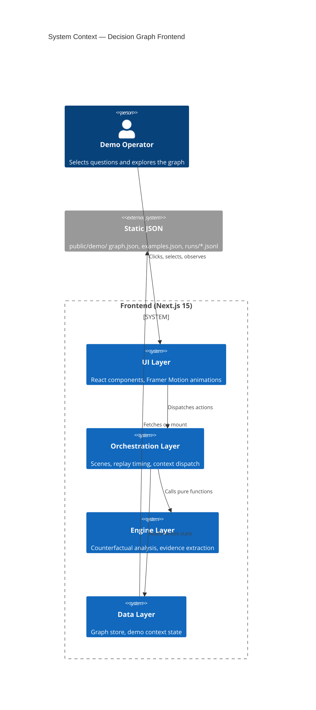
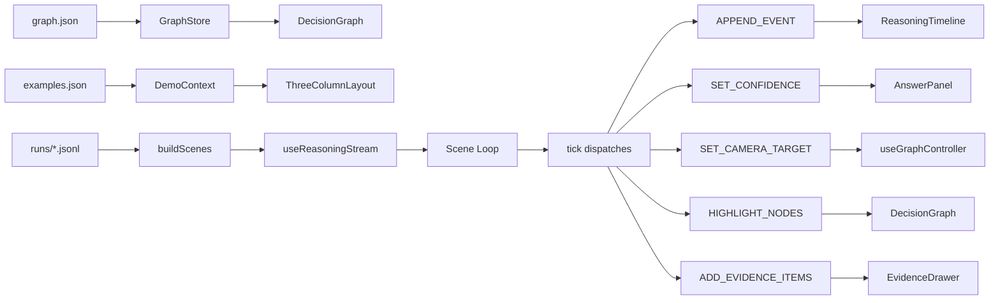
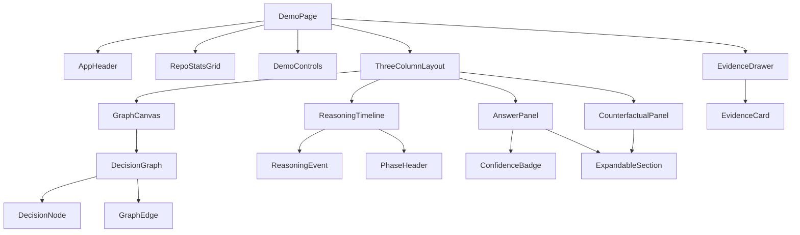

# Decision Graph — Frontend Architecture

## Overview

The Decision Graph frontend is a Next.js 15 App Router application that visualizes decisions extracted from GitHub repositories. It runs fully client-side, loading pre-computed graphs and run logs from static JSON files.

## High-Level Architecture



## Data Flow



## Page Structure

```
app/
  page.tsx          — Landing page (fade-in hero, two CTAs)
  demo/page.tsx     — Main demo page (controls, graph, panels)
```

## Component Tree



## State Management

A single React Context (`DemoContext`) holds all application state. The `useReducer` pattern provides deterministic state transitions through well-defined actions.

### Key State Slices

| Slice | Type | Consumers |
|-------|------|-----------|
| `graph` | `GraphStore \| null` | DecisionGraph, AnswerPanel (via store APIs) |
| `timeline` | `RunEvent[]` | ReasoningTimeline |
| `answer` | `AnsweredQuestion \| null` | AnswerPanel |
| `evidenceItems` | `EvidenceCardData[]` | EvidenceDrawer |
| `highlightedNodeIds` | `string[]` | DecisionGraph |
| `cameraTarget` | `{nodeId, zoom} \| null` | useGraphController |
| `currentConfidence` | `number` | AnswerPanel, EvidenceDrawer |
| `counterfactualResult` | `CounterfactualResult \| null` | CounterfactualPanel |
| `hypotheticalNodeIds` | `string[]` | DecisionGraph (counterfactual) |
| `predictedNodeIds` | `string[]` | DecisionGraph (counterfactual) |

## Key Directories

```
frontend/
  app/                  — Next.js routes
  components/
    demo/               — DemoControls
    evidence/           — EvidenceDrawer, EvidenceCard
    graph/              — DecisionGraph, GraphCanvas, nodes/, edges/
    layout/             — AppHeader, ThreeColumnLayout
    query/              — AnswerPanel, CounterfactualPanel, ConfidenceBadge, ExpandableSection
    reasoning/          — ReasoningTimeline, ReasoningEvent, PhaseHeader
    repo/               — RepoStatsGrid, StatCard
    shared/             — Skeleton, EmptyState
  hooks/                — useReasoningStream, useGraphController
  lib/                  — demo-context, graph-store, types, utils, counterfactual-engine, evidence-extractor, replay-orchestrator
  public/demo/          — Static data (graph.json, examples.json, runs/)
```
