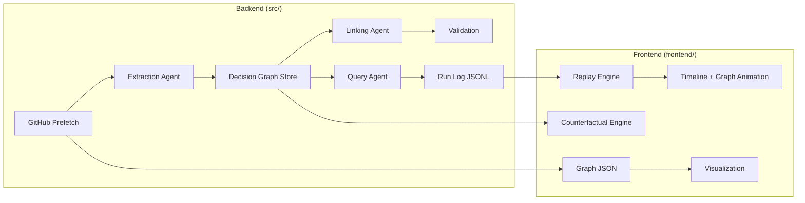
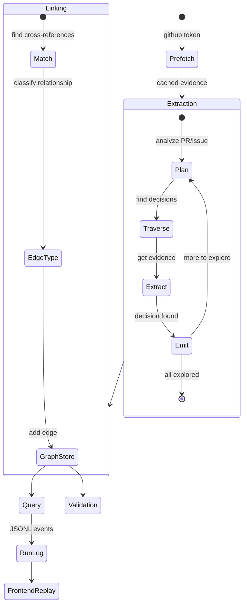
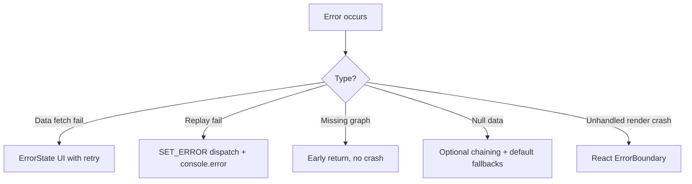

# Decision Graph — System Design

## Overview

The Decision Graph system reconstructs product decisions from engineering evidence (PRs, issues, commits, Slack discussions) and surfaces them through a graph-based query interface.

---

## Pipeline Architecture



---

## Decision Graph Lifecycle



---

## Replay Architecture

```mermaid
flowchart TB
    subgraph Data
        RL[Run Log JSONL] --> BS[buildScenes]
        G[Graph JSON] --> BS
    end

    subgraph Orchestration
        BS --> SC[Scene[]]
        SC --> LP[Loop: for each scene]
        LP --> |scene.waitBefore| SLEEP[await sleep]
        LP --> |scene.confidence| SC1[SET_CONFIDENCE]
        LP --> |scene.cameraTarget| SC2[SET_CAMERA_TARGET]
        LP --> |scene.highlightedNodeIds| SC3[HIGHLIGHT_NODES]
        LP --> |scene.timelineEvent| SC4[APPEND_EVENT]
        LP --> |extract| SC5[ADD_EVIDENCE_ITEMS]
        LP --> |scene.answerPhase| SC6[SET_ANSWER_PHASE]
    end

    subgraph Timing
        DIR[Scene delays by type]
        SPD[Speed multiplier]
        HERO[Hero pauses: 1.2s initial, 600ms before answer]
    end

    LP --> |all scenes done| DONE[SET_COMPLETE]
```

---

## Key Design Decisions

### 1. Single Orchestrator Loop

All timing is owned by `buildScenes` + `useReasoningStream`. No `setTimeout`/`setInterval` in components, no independent clocks. This ensures deterministic replay regardless of browser paint timing.

### 2. Pure-Function Counterfactual Engine

`computeCounterfactual(questionId, graph)` is a pure function using only `GraphStore` public APIs (`getDecision()`, `neighbors()`, `edges()`). It never mutates the graph — returns an independent result tree with hypothetical and predicted node IDs for visual distinction.

### 3. Evidence Deduplication by URL

The `knownUrls` Set persists across the entire replay via a `useRef`, ensuring every evidence URL appears only once regardless of how many events reference it.

### 4. Static Deployment

The frontend is a fully static Next.js export. All data is pre-computed and stored in `public/demo/`:

| File | Size | Contents |
|------|------|----------|
| `graph.json` | 34 KB | 12 nodes, 15 edges, full decision objects |
| `dropdown-hero.jsonl` | 4.8 KB | Run log: 40+ events |
| `alert-evolution.jsonl` | 3.9 KB | Run log: 30+ events |
| `examples.json` | 1.1 KB | 6 demo questions (4 replay, 2 counterfactual) |

---

## Error Handling Strategy



All error paths were hardened during Phase 10 validation. Key protections:
- Null guards on `graph` parameter in counterfactual engine
- Null guards on `event.input` in evidence extractor and replay orchestrator
- Empty array defaults on all `map()`, `filter()`, `find()` calls
- `SET_ERROR` action type surfaces replay failures to the UI
- `try/catch` wrapped around `handleSelectExample` and replay loop
